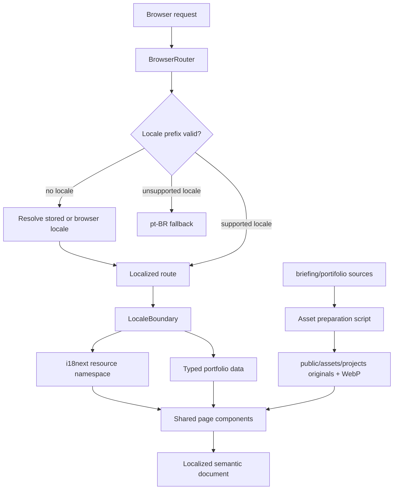

# Portfolio V1 Design

**Spec**: `.specs/features/portfolio-v1/spec.md`  
**Status**: Approved

---

## Architecture Decision

Three approaches were considered:

| Approach | Strengths | Costs |
| --- | --- | --- |
| React Router + i18next/react-i18next | Mature locale switching, nested locale routes, reusable page tree, established translation tooling | Adds runtime dependencies and needs a parity gate |
| React Router + custom typed locale modules | Small runtime surface and compile-time control | Requires custom interpolation, fallback, and translation utilities |
| Duplicated page trees by locale | Direct and conceptually simple | Duplicates structure and makes content drift likely |

Leonardo selected React Router with i18next/react-i18next.

## Architecture Overview

The app remains a client-rendered Vite SPA. React Router declarative mode owns the URL hierarchy. A locale boundary validates `:locale`, synchronizes i18next, updates document metadata, and renders one shared component tree for both languages.

Factual project data stays separate from translated prose. Stable identifiers, dates, asset paths, technologies, and project status live in typed TypeScript records. i18next namespaces contain interface labels, editorial copy, metadata, alternative text, and resume prose. A deterministic parity validator rejects missing or extra required translation keys.

Historical assets are copied from the ignored briefing archive into a tracked public hierarchy by a repeatable preparation script. Original files are retained, and optimized WebP derivatives are generated for the rendered galleries.



## Route Model

| Route | Page | Notes |
| --- | --- | --- |
| `/` and locale-less paths | `LocaleResolver` | Uses remembered explicit choice, then browser language, then `pt-BR` |
| `/:locale` | `HomePage` | Supports `pt-br` and `en` |
| `/:locale/work` | `WorkPage` | Lists priority work; archive remains deferred |
| `/:locale/work/:projectSlug` | `CaseStudyPage` | Allows only the four priority project slugs |
| `/:locale/about` | `AboutPage` | Localized semantic resume and English PDF download |
| `/:locale/*` | `NotFoundPage` | Localized recovery for valid locales |
| Unsupported first segment | `UnsupportedLocaleRedirect` | Redirects to equivalent `pt-br` path when possible |

`Timeline`, `Resume`, and `Contact` global links target stable section IDs on the localized Home or About route. The route helper owns this mapping so navigation and locale switching do not reconstruct paths ad hoc.

Direct production access to BrowserRouter paths requires the static host to rewrite unknown requests to `index.html`. Deployment is outside this feature, but the requirement is documented as a hosting prerequisite.

---

## Code Reuse Analysis

### Existing Components to Leverage

| Existing code | Location | How to use |
| --- | --- | --- |
| React root and Strict Mode | `src/main.tsx` | Keep the bootstrap and wrap the app with `BrowserRouter` and i18next initialization |
| Vite React Compiler setup | `vite.config.ts` | Preserve the existing React plugin and compiler preset |
| Oxlint rules | `.oxlintrc.json` | Keep as the implementation lint gate |
| CSS custom-property pattern | `src/index.css` | Replace template values with the portfolio token set |
| Source editorial content | `briefing/CONTENT.md` | Use as the approved English copy source |
| Visual asset map | `briefing/ASSETS.md` | Use for asset naming, grouping, sequence, and hero selection |
| Current resume | `briefing/Leonardo_Vitale_-_Front_End_Engineer_NEW.md` | Use for resume facts, contact, role history, and supported metrics |

The template `App.tsx`, `App.css`, React/Vite logos, counter, and generic Vite sections provide no product behavior and will be replaced.

### Integration Points

| System | Integration method |
| --- | --- |
| React Router | Declarative `BrowserRouter`, nested locale route, shared `SiteLayout`, route helpers |
| i18next/react-i18next | Static locale resource imports, namespaces, `useTranslation`, explicit `changeLanguage` at locale boundary |
| Browser locale | `navigator.languages` first supported match |
| Locale persistence | Guarded `localStorage` adapter with `portfolio.locale` key |
| Document metadata | React effect updates `document.lang`, title, description, and canonical link per route and locale |
| Public assets | Stable absolute paths from typed project records |

---

## Proposed File Structure

```text
scripts/
  prepare-assets.mjs
src/
  app/
    AppRouter.tsx
    routes.ts
    metadata.ts
  i18n/
    config.ts
    locale.ts
    parity.ts
  content/
    portfolio.ts
    resume.ts
    types.ts
  locales/
    en/
      common.json
      home.json
      work.json
      cases.json
      about.json
    pt-BR/
      common.json
      home.json
      work.json
      cases.json
      about.json
  components/
    layout/
      SiteHeader.tsx
      SiteFooter.tsx
      SiteLayout.tsx
      LanguageSelector.tsx
    home/
      Hero.tsx
      CareerSignals.tsx
      SelectedWork.tsx
      CareerTimeline.tsx
      CurrentChapter.tsx
      AboutPreview.tsx
    work/
      ProjectCard.tsx
      CaseGallery.tsx
      CaseMetadata.tsx
  pages/
    HomePage.tsx
    WorkPage.tsx
    CaseStudyPage.tsx
    AboutPage.tsx
    NotFoundPage.tsx
  styles/
    tokens.css
    base.css
    layout.css
    components.css
    pages.css
public/
  assets/projects/
    microsoft-gpa/
    net-now/
    sky-online/
    xbox-one/
  resume/
    leonardo-vitale-resume-en.pdf
```

The final task breakdown may co-locate small single-use components when that keeps a task atomic. The structure is a boundary guide, not a requirement to create empty files.

---

## Components

### AppRouter

- **Purpose**: Declare locale resolution, shared layout, page routes, priority-case routes, and localized not-found behavior.
- **Location**: `src/app/AppRouter.tsx`
- **Interfaces**:
  - `AppRouter(): ReactElement`
- **Dependencies**: React Router, `LocaleBoundary`, page components, route helpers.
- **Reuses**: Existing React root in `src/main.tsx`.

### LocaleBoundary and Locale Utilities

- **Purpose**: Validate URL locale, synchronize i18next, persist explicit selection, set `document.lang`, and preserve route identity during language changes.
- **Location**: `src/i18n/locale.ts`, consumed by `src/app/AppRouter.tsx`
- **Interfaces**:
  - `normalizeLocale(value: string | undefined): Locale | null`
  - `resolveInitialLocale(stored: unknown, browserLanguages: readonly string[]): Locale`
  - `switchLocale(pathname: string, target: Locale): string`
  - `readStoredLocale(storage: StorageLike): Locale | null`
  - `writeStoredLocale(storage: StorageLike, locale: Locale): void`
- **Dependencies**: i18next, React Router location/navigation APIs, guarded browser storage.
- **Reuses**: Locale behavior fixed in `context.md`.

### SiteLayout

- **Purpose**: Provide semantic header, navigation, main outlet, footer, skip link, and fixed dark-theme shell.
- **Location**: `src/components/layout/SiteLayout.tsx`
- **Interfaces**:
  - `SiteLayout(): ReactElement`
- **Dependencies**: React Router `Outlet`, i18next, `LanguageSelector`.
- **Reuses**: Navigation and accessibility constraints from `briefing/DESIGN.md`.

### LanguageSelector

- **Purpose**: Expose Portuguese and English choices while preserving the equivalent page.
- **Location**: `src/components/layout/LanguageSelector.tsx`
- **Interfaces**:
  - `LanguageSelector({ locale }: { locale: Locale }): ReactElement`
- **Dependencies**: Locale utilities, router navigation, i18next labels.
- **Reuses**: `switchLocale` and locale persistence.

### HomePage

- **Purpose**: Compose positioning, career signals, selected work, timeline, current chapter, and About preview.
- **Location**: `src/pages/HomePage.tsx`
- **Interfaces**:
  - `HomePage(): ReactElement`
- **Dependencies**: Home section components, typed portfolio records, i18next `home` namespace.
- **Reuses**: Editorial sequence from `briefing/EDITORIAL.md`.

### SelectedWork and ProjectCard

- **Purpose**: Render the responsive five-item editorial mosaic and localized project summaries.
- **Location**: `src/components/home/SelectedWork.tsx`, `src/components/work/ProjectCard.tsx`
- **Interfaces**:
  - `SelectedWork({ projects }: { projects: readonly ProjectSummary[] }): ReactElement`
  - `ProjectCard({ project, emphasis }: ProjectCardProps): ReactElement`
- **Dependencies**: Typed project records, route helpers, localized copy.
- **Reuses**: Asset hero choices from `briefing/ASSETS.md`.

### CareerTimeline

- **Purpose**: Render the eight ordered transitions and receive the global Timeline anchor.
- **Location**: `src/components/home/CareerTimeline.tsx`
- **Interfaces**:
  - `CareerTimeline({ milestones }: { milestones: readonly CareerMilestone[] }): ReactElement`
- **Dependencies**: Typed milestone records and localized descriptions.
- **Reuses**: Timeline from `briefing/EDITORIAL.md` and `briefing/DESIGN.md`.

### WorkPage

- **Purpose**: Present priority work as a calmer index separate from the Home mosaic.
- **Location**: `src/pages/WorkPage.tsx`
- **Interfaces**:
  - `WorkPage(): ReactElement`
- **Dependencies**: Project records, `ProjectCard`, i18next `work` namespace.
- **Reuses**: Shared cards and route helpers.

### CaseStudyPage

- **Purpose**: Render the common case template for NET NOW, Xbox One, SKY Online, and Microsoft/GPA.
- **Location**: `src/pages/CaseStudyPage.tsx`
- **Interfaces**:
  - `CaseStudyPage(): ReactElement`
- **Dependencies**: Router slug, project record lookup, `CaseMetadata`, `CaseGallery`, i18next `cases` namespace.
- **Reuses**: One common template prevents structural drift between cases and locales.

### CaseGallery

- **Purpose**: Render ordered historical assets with intrinsic dimensions, localized alternative text, lazy loading, and non-blocking image failures.
- **Location**: `src/components/work/CaseGallery.tsx`
- **Interfaces**:
  - `CaseGallery({ assets }: { assets: readonly ProjectAsset[] }): ReactElement`
- **Dependencies**: Public asset records and localized accessibility strings.
- **Reuses**: Asset sequences from `briefing/ASSETS.md`.

### AboutPage

- **Purpose**: Render localized profile, accomplishments, experience, education, expertise, contact links, and English PDF download.
- **Location**: `src/pages/AboutPage.tsx`
- **Interfaces**:
  - `AboutPage(): ReactElement`
- **Dependencies**: Resume records, i18next `about` namespace, public resume PDF.
- **Reuses**: Current resume source and global contact values.

### NotFoundPage

- **Purpose**: Explain an unknown route in the active locale and return to localized Home.
- **Location**: `src/pages/NotFoundPage.tsx`
- **Interfaces**:
  - `NotFoundPage(): ReactElement`
- **Dependencies**: Route helpers and i18next `common` namespace.
- **Reuses**: `SiteLayout`.

### Metadata Controller

- **Purpose**: Keep document title, description, canonical URL, and language aligned with the current route.
- **Location**: `src/app/metadata.ts`
- **Interfaces**:
  - `applyPageMetadata(metadata: PageMetadata): () => void`
- **Dependencies**: Browser document APIs and localized metadata.
- **Reuses**: Existing `index.html` metadata nodes where possible.

### Asset Preparation Script

- **Purpose**: Copy all 80 approved source images into deterministic project folders, emit a manifest with dimensions, and generate WebP derivatives.
- **Location**: `scripts/prepare-assets.mjs`
- **Interfaces**:
  - CLI script invoked through `pnpm assets:prepare`
- **Dependencies**: Node filesystem APIs and `sharp` as a development dependency.
- **Reuses**: Grouping and ordering from `briefing/ASSETS.md`.

---

## Data Models

### Locale and Route Identity

```typescript
export const locales = ['pt-BR', 'en'] as const
export type Locale = (typeof locales)[number]

export type RouteId =
  | 'home'
  | 'work'
  | 'about'
  | 'case.net-now'
  | 'case.xbox-one'
  | 'case.sky-online'
  | 'case.microsoft-gpa'
  | 'not-found'
```

URL segments map `pt-BR` to `pt-br` and preserve `en`. Route IDs, rather than string replacement, define equivalent paths.

### Project

```typescript
export interface Project {
  id: 'net-now' | 'xbox-one' | 'sky-online' | 'microsoft-gpa' | 'xelix'
  slug: string
  period: string
  role: string
  tags: readonly string[]
  status: 'shipped' | 'prototype' | 'leadership'
  featuredAsset?: string
  assets: readonly ProjectAsset[]
  translationKey: string
}

export interface ProjectAsset {
  id: string
  originalSrc: string
  optimizedSrc: string
  width: number
  height: number
  altKey: string
}
```

Dates, roles, tags, statuses, and asset geometry are stable facts. Narrative fields resolve through `translationKey`.

### Career Milestone

```typescript
export interface CareerMilestone {
  id: string
  period: string
  labelKey: string
  descriptionKey: string
}
```

The exported array order is the required timeline order.

### Resume

```typescript
export interface ResumeExperience {
  id: string
  company: string
  period: string
  titleKey: string
  locationKey: string
  achievementKeys: readonly string[]
}
```

Company names and periods remain factual; translated titles, locations, and achievements resolve through keys.

### Translation Contract

Each namespace has the same recursive key shape in `en` and `pt-BR`. Arrays used as editorial sequences have stable item IDs rather than index-only identity. The parity gate compares recursive leaf-key sets and fails on missing required values or empty strings.

---

## Styling Architecture

- `tokens.css` defines the fixed dark palette, typography, spacing, content widths, radii, motion durations, and focus treatment.
- `base.css` owns reset, body defaults, semantic typography, links, images, and reduced-motion rules.
- `layout.css` owns site shell, global grid, sections, and responsive breakpoints.
- `components.css` owns reusable navigation, buttons, cards, metadata, timeline, and gallery primitives.
- `pages.css` owns page-specific editorial composition.

CSS Grid creates the desktop exhibition wall. A single-column layout replaces the mosaic at the mobile breakpoint. CSS controls layout and hover/focus states; React does not measure or position content.

The theme does not use `prefers-color-scheme`. `prefers-reduced-motion` removes nonessential transforms, transitions, and reveal behavior.

---

## Verification Architecture

The repository currently has no tests. The recommended minimum deterministic stack is:

- Vitest for locale resolution, path mapping, translation parity, content invariants, and metadata utilities.
- Playwright browser tests for locale routing, page rendering, keyboard paths, viewports, reduced motion, direct routes, and asset/PDF failure behavior.
- Oxlint and TypeScript/Vite build as structural gates.
- Manual browser review for the 30-second comprehension test and final visual hierarchy.

Tests map to specification outcomes rather than implementation details. Exact test types and commands require user confirmation during the Tasks phase, as required by the workflow.

---

## Error Handling Strategy

| Error scenario | Handling | User impact |
| --- | --- | --- |
| Locale-less first visit | Resolve stored choice, then supported browser language, then `pt-BR` | Visitor reaches a supported localized route |
| Unsupported locale prefix | Redirect to equivalent `pt-br` destination when route identity is known | No blank or mixed-language page |
| Invalid stored locale | Ignore value and run first-visit resolution | Corrupt preference does not break navigation |
| Storage unavailable | Catch access failure and continue with URL locale | Site works without persistence |
| Missing translation key | Fail parity/publication gate | Incomplete bilingual page is not published |
| Unknown project slug | Render localized not-found page | Visitor can return to Home |
| Image load failure | Preserve intrinsic frame, alt text, and case narrative | Evidence is unavailable but content remains readable |
| Resume PDF unavailable | Keep localized HTML resume and show localized unavailable state | Resume remains usable |
| Metadata node absent | Create or update the required node idempotently | Page remains usable and metadata is repaired |

---

## Risks & Concerns

| Concern | Location | Impact | Mitigation |
| --- | --- | --- | --- |
| App is still the generic Vite template | `src/App.tsx:1`, `src/App.css:1`, `src/index.css:1` | No product code is reusable beyond bootstrap/config | Replace template code in the foundation phase; preserve only proven Vite and lint setup |
| Briefing and source assets are ignored by Git | `.gitignore:26`, `briefing/portifolio/` | Build inputs could disappear on another checkout | Copy approved assets and resume into tracked `public/`; move runtime copy into tracked locale resources |
| No existing test runner or tests | `package.json:6` | Specification outcomes can regress silently | Add the user-approved minimum Vitest/Playwright gates before feature code |
| BrowserRouter needs host rewrite support | `src/app/AppRouter.tsx` | Direct production URLs can return server 404 | Document `index.html` fallback as a deployment prerequisite and verify direct paths in preview |
| Translation drift across namespaces | `src/locales/` | One locale can ship incomplete content | Recursive parity test fails on missing, extra required, or empty translation leaves |
| Eighty original images can inflate transfer size | `briefing/portifolio/` | Slow galleries and layout instability | Generate WebP derivatives, lazy-load below-fold media, include dimensions, keep original download out of rendered `src` |
| Duplicate Unicode filename variants exist in SKY assets | `briefing/portifolio/SkyOnline/` | Non-portable paths and accidental duplicate output | Normalize destination names through an explicit asset manifest |
| Resume and editorial sources contain claim conflicts | `briefing/*.pdf`, `briefing/CONTENT.md` | Incorrect dates, titles, or ownership can be published | Use the source precedence in the spec and encode reviewed facts once in typed data |
| Portuguese copy does not yet exist as a complete artifact | `briefing/CONTENT.md:5` | Literal or incomplete translation can weaken credibility | Translate by namespace, preserve factual fields, and run parity plus human editorial review |
| Fixed dark theme can hide contrast failures | `src/styles/tokens.css` | Text or focus state can fail accessibility | Define token pairs against WCAG 2.2 AA and verify focus at 3:1 |

---

## Tech Decisions

| Decision | Choice | Rationale |
| --- | --- | --- |
| Routing and i18n | React Router declarative mode + i18next/react-i18next | User-selected mature library approach with one shared page tree |
| Content split | Typed factual records plus localized i18next namespaces | Prevents dates, assets, and project status from drifting between languages |
| Locale URL | `/pt-br/...` and `/en/...` with route-ID mapping | Produces shareable URLs and safe equivalent-page switching |
| Initial locale | Stored explicit choice, then browser language, then `pt-BR` | Implements the approved visitor behavior |
| Asset delivery | Tracked originals plus generated WebP derivatives and dimension manifest | Preserves sources while serving optimized gallery media |
| Layout | Semantic React composition and CSS Grid/Flexbox | Keeps JavaScript out of layout and supports responsive transformation |
| Metadata | Small document metadata utility | Avoids another runtime dependency for a static prototype |
| Test recommendation | Vitest plus Playwright | Covers pure locale/content contracts and real route/viewport behavior |

The routing and i18n selection is recorded as project-level decision `AD-001` in `.specs/STATE.md`.
